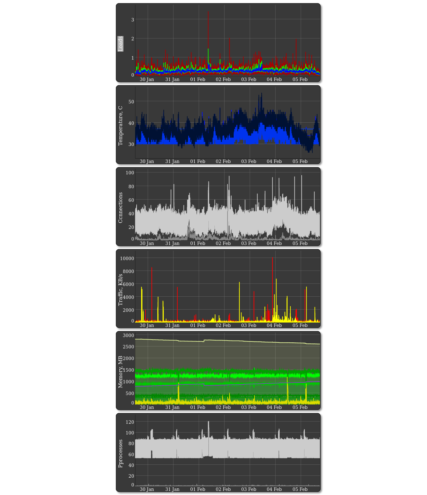
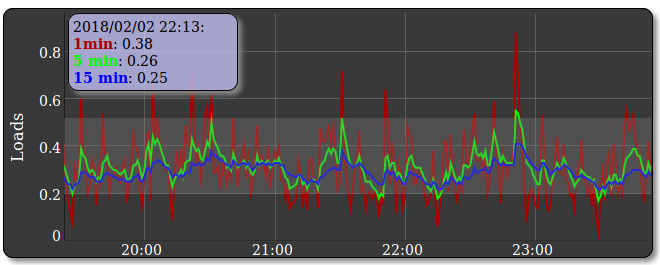

## Simple *nux Server Monitoring
Simple monitoring of core measurements on *nix systems: statistics in CSV files and dynamic graphs (dygraph) in HTML. 
No special databases or web-servers required. Simple HTML that parses CSV files - very fast and no dynamic content. Plots can be zoomed both X- and Y-wise.
Current configuration includes 7 days statistic: 10,080 measurements = 7 days * 24 hours * 60 minutes.

## Installation
No special procedures, place HTML file in the web-server folder and run Bash script regularly to gather statistic.

## Measurements

## Dependencies
- Dygraph (included online)
- uptime
- awk
- sysctl
- tr
- smartctl
- grep
- touch
- netstat
- ifstat
- top
- sed
- cat

Eventual tuning is required depending on the system

## Cron
Every 1 minute, HDD polling - 10 minutes due to latency

\* \* \* \* \* update_mon.sh   2>&1
