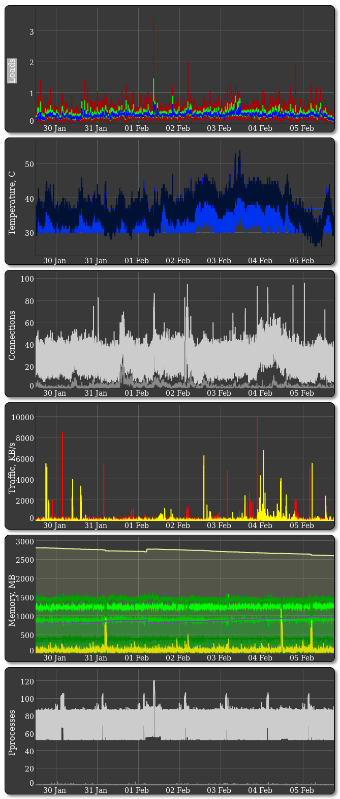

## Simple-Server-Monitoring
Simple monitoring of core measurements on *nix systems: statistics in CSV files and dynamic graphs in HTML
No special databases or web-servers required. Simple HTML that parses CSV files - very fast due to no dynmic content.
Plots can be zoomed.

7 days statistic: 10,080 measurements = 7 days * 24 hours * 60 minutes

## Dependencies
- Dygraph (included online)
- uptime
- awk
- sysctl
- tr
- smartctl
- grep
- touch
- netstat
- ifstat
- top
- sed
- cat

Eventual tuning is required depending on the system

## Measurements

## Cron - 1 minute, HDD polling - 10 minutes (latency)

\* \* \* \* \* update_mon.sh   2>&1
